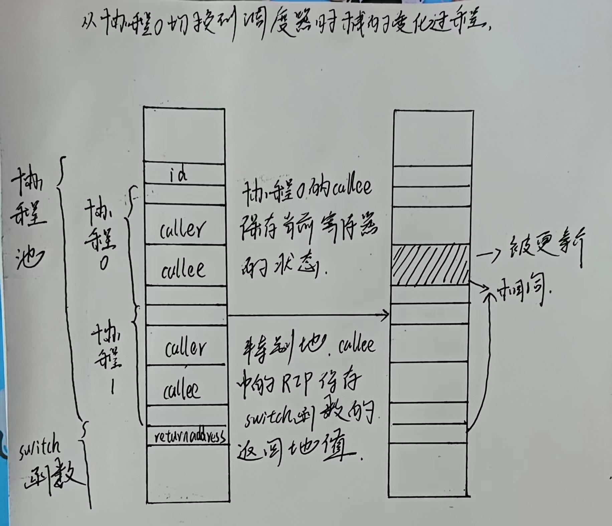
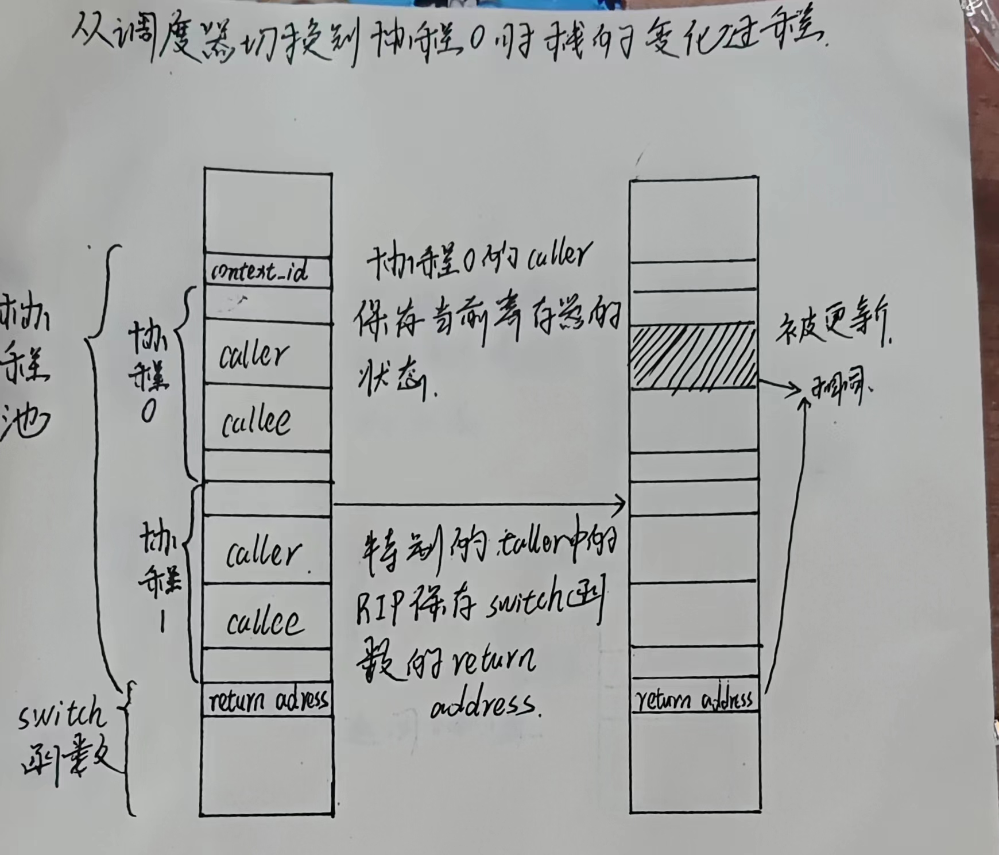
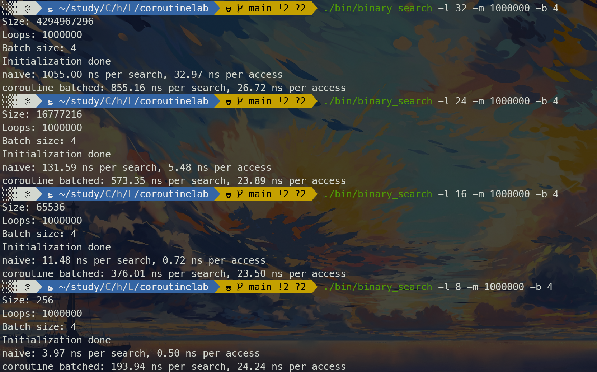
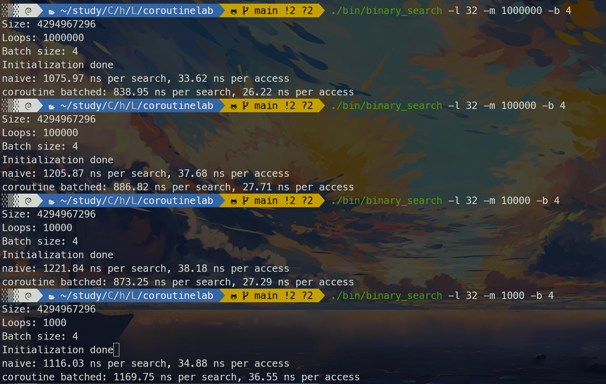
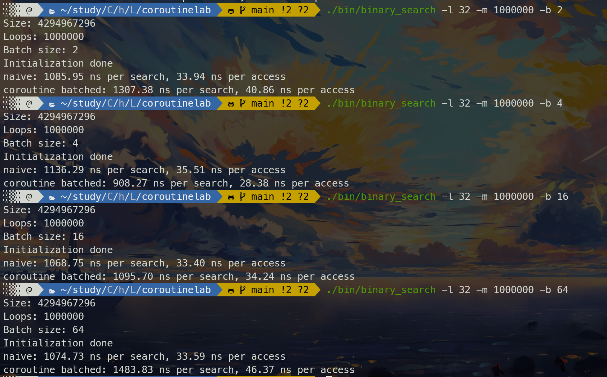

## 实验报告
1. 
    - 吕嘉鑫 2022010771 计22
2.  
    - **Task1**
        1. 代码
        - *coroutine_pool::serial_execute_all()*
        ```c
        bool needDo = true; // 判断是否还有进程没有完成
        while (needFinish) {
            int n = coroutines.size(); //获取进程数量                
            needDo = false;
            for (int i = 0; i < n; i++) { //遍历
                g_pool->context_id = i; //更改id为当前进程的id
                if (!coroutines[i]->finished) {
                    needDo = true; // 还有进程没有完成
                    coroutines[i]->resume(); // 恢复运行
                }
            }
        }
        ```
        - *context.S*
        ```c
        .global coroutine_switch
        coroutine_switch:
            # 保存 callee-saved 寄存器到 %rdi 指向的上下文
            movq %rax, (%rdi)
            movq %rdi, 8(%rdi)
            movq %rsi, 16(%rdi)
            movq %rdx, 24(%rdi)
            movq %r8,  32(%rdi)
            movq %r9,  40(%rdi)
            movq %r10, 48(%rdi)
            movq %r11, 56(%rdi)
            movq %rsp, 64(%rdi)
            movq %rbx, 72(%rdi)
            movq %rbp, 80(%rdi)
            movq %r12, 88(%rdi)
            movq %r13, 96(%rdi)
            movq %r14, 104(%rdi)
            movq %r15, 112(%rdi)
            # 保存的上下文中 rip 指向 ret 指令的地址（.coroutine_ret）
            leaq .coroutine_ret(%rip), %rcx
            movq %rcx, 120(%rdi)
            # 从 %rsi 指向的上下文恢复 callee-saved 寄存器
            movq (%rsi),   %rax
            movq 8(%rsi),  %rdi
            movq 24(%rsi), %rdx
            movq 32(%rsi), %r8
            movq 40(%rsi), %r9
            movq 48(%rsi), %r10
            movq 56(%rsi), %r11
            movq 64(%rsi), %rsp
            movq 72(%rsi), %rbx
            movq 80(%rsi), %rbp
            movq 88(%rsi), %r12
            movq 96(%rsi), %r13
            movq 104(%rsi), %r14
            movq 112(%rsi), %r15
            # 取出之前保存的返回位置给%rcx
            movq 120(%rsi), %rcx
            # %rsi需要在最后恢复
            movq 16(%rsi), %rsi
            # 最后 jmpq 到上下文保存的 rip
            jmpq  *%rcx
        .coroutine_ret:
            ret
        ```
        - *yield()*
        ```c
        // 从当前协程切换到调度器
        coroutine_switch(context->callee_registers, context->caller_registers);
        ```
        - *resume()*
        ```c
        // 从调度器切换到当前协程
        coroutine_switch(context->callee_registers, context->caller_registers);
        ```
        2. 协程切换的时候栈的变化过程
        
        
        3. 协程执行过程
        - 第一次对每个协程调用resume的时候，因为每个协程初始化的时候把rip设置为coroutine_entry的地址，所以就会进入coroutine_entry执行，然后这个函数中，将该协程自己作为参数传给coroutine_main函数，然后coroutine_main这个函数中启动每个函数，并且运行完之后更改其finished状态，并且切回到调度器(coroutine_main和要使用的参数都在构造的时候初始化好了)
        - 当协程函数遇到yield的时候，就会切回到调度器，然后调度器开始决定下一个需要执行的协程，并且调用resume切换到该协程执行
        - 当协程函数run结束了，则finished状态被更改，从coroutine_main函数切回到调度器(coroutine_main函数只会被调用，不会返回)，此后该协程都不会被调度器调用
        - 当所有的协程都完成之后，调度器发现没有协程需要切换，整个协程运行结束
    - **Task2**
        1. 代码
        - *coroutine_pool::serial_execute_all()*
        ```c
        bool needDo = true; // 判断是否还有进程没有完成
        while (needFinish) {
            int n = coroutines.size(); //获取进程数量                
            needDo = false;
            for (int i = 0; i < n; i++) { //遍历
                g_pool->context_id = i; //更改id为当前进程的id
                if (!coroutines[i]->finished) {
                    needDo = true; // 还有进程没有完成
                    if (coroutines[i]->ready) // 已经准备好恢复运行
                        coroutines[i]->resume();
                    else if (coroutines[i]->ready_func()) { // 查看是否可以恢复运行
                        coroutines[i]->ready = true; // 恢复可运行状态
                        coroutines[i]->resume();
                    }
                }
            }
        }
        ```
        - *sleep(uint64_t ms)*
        ```c
        auto context = g_pool->coroutines[g_pool->context_id]; // 从 g_pool 中获取当前协程状态
        context->ready = false;
        // 获取当前时间，更新 ready_func
        // ready_func：检查当前时间，如果已经超时，则返回 true
        auto wakeup_time = get_time() + std::chrono::milliseconds(ms);
        context->ready_func = [wakeup_time]() { return get_time() >= wakeup_time; };
        coroutine_switch(context->callee_registers, context->caller_registers); // 调用 coroutine_switch, 从当前协程切换到调度器
        ```
        2. sleep_sort中各个协程的运行情况
        - 第一轮调度器切至每个协程后，每个协程执行sleep函数，在sleep函数中将ready改为false，设置好ready_fun函数，然后就切回到调度器，直到第一轮调度结束
        - 此后调度器再切换协程的时候，发现ready为false，于是轮询每个协程的ready_fun，如果返回true，就更改ready为true，并切入该协程执行，在该题中，协程会直接运行结束，于是将该协程从轮询队列中取出，继续轮询剩下的协程，直到所有协程完成
        3. 协程库新的实现方式
        - 在被阻塞的协程中设置定时器，时间到了就向调度器发送通知，然后调度器开始调用该协程，这样调度器在等待的时候就不会一直轮询来做大量无用消耗
    - **Task3**
        1. 代码
        - *lookup_coroutine*
        ```c
        __builtin_prefetch(&table[probe]); // 使用 __builtin_prefetch 预取容易产生缓存缺失的内存
        yield(); // 并调用 yield从当前协程切换到调度器
        ```
        2. 性能报告
        - 首先明确协程相比naive的性能差异在哪些方面
            - 额外开销
                1. 协程的创建和销毁
                2. 协程之间切换的开销
            - 性能优化
                1. 预取缓存，避免不命中
        - 搜索空间(`-l`)
            - 搜索空间较大时，协程优化效果不错，但是搜索空间比较小的时候，协程性能大幅度下降，而且`per access`的时间有一个下限，远大于naive下的时间
            - 性能下降说明额外开销远大于性能优化，而且naive下的`per access`的时间可以降到很低，说明在前几轮询问中数组中的大量元素都被加载到快表或类似的结构中，故可以很快被访问，而协程下，每次都会调用预取和切换，这也是为什么其下限远大于同等下naive时间的原因
            
        - 询问次数(`-m`)
            - 在较小的循环次数下，协程批处理的性能相对较差，可能是额外开销在整个搜索过程中占比较大
            
        - 批处理大小(`-b`)
            - 随着批处理大小的增加，协程批处理的性能相对变差。在较大的批处理中，协程的创建和销毁开销可能更显著，导致性能下降
            - 当批处理太小时，性能也会变差，可能是因为预取还未完成或者创建和销毁协程池太过频繁
            
        - 综上，在搜索空间较大，询问次数较多的情况下，通过选取合适的批处理大小，协程优化的效果不错