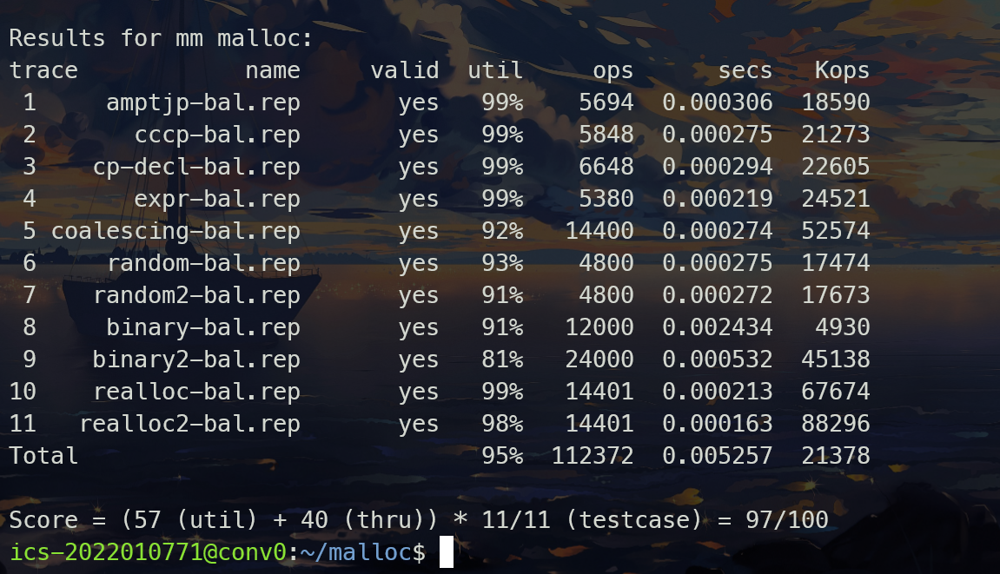

# MALLOC LAB
## 整体思路
**显示空闲链表+分离适配**
- 划分多个大小类，以2的幂次来划分，从32开始，所以依次就是{32, 48}, {64, 80, 96, 112} ...
- 堆的起始位置后存放各个大小类的指针，指向对应大小类中的一个空闲块，然后加上序言块
- 每个普通块有一个表头和表尾，存储大小和是否分配信息，如果已分配，则无其他信息，若未分配，则在表头下方存储后继和前驱，分别指向所属大小类的后一个和前一个空闲块
## 分配回收算法实现
#### 1. 宏定义
参考书上的还有网上的
https://github.com/YaleXin/CS-APP3e-Labs/blob/main/Malloc-Lab/mm-v3.c

#### 2. 分配（mm_malloc）

- 如果请求大小为0，则直接返回NULL。
- 根据请求大小调整为合适的块大小（确保为16的倍数）。
- 调用`find_fit`函数在空闲链表中找到适合大小的空闲块。
- 如果找到，调用`place`函数进行分配；否则，调用`extend_heap`函数扩展堆，并再次调用`place`进行分配。

#### 3. 回收（mm_free）

- 如果传入的指针为NULL，则直接返回。
- 将块的头尾标记为未分配状态。
- 调用`coalesce`函数合并相邻的空闲块，并将合并后的块插入到空闲链表中。

#### 4. 重新分配（mm_realloc）

- 如果传入的指针为NULL，则等同于调用`mm_malloc`。
- 如果请求大小为0，则等同于调用`mm_free`。
- 计算调整后的大小（确保为16的倍数）。
- 根据不同情况执行以下操作：
  - 如果新大小等于旧大小，则直接返回原指针。
  - 如果下一个块为空闲且合并后的大小足够满足新大小，则合并并分配。
  - 如果下一个块为堆的末尾，且需要扩展堆以满足新大小，则扩展堆，并相应地更新块的大小。
  - 否则，调用`mm_malloc`分配新的内存块，将数据从旧块复制到新块，然后释放旧块。

#### 5. 扩展堆（extend_heap）

- 调用`mem_sbrk`函数扩展堆，分配指定大小的空间。
- 更新新块的头部、尾部以及下一个块的头部。
- 调用`coalesce`进行合并

#### 6. 合并相邻空闲块（coalesce）

- 根据前后相邻块的分配情况，分四种情况决定是否合并当前块。
- 根据合并后的大小，将块从空闲链表中移除，合并后再插入空闲链表中。

#### 7. 查找适配空闲块（find_fit）

- 根据请求大小，在空闲链表中找到合适大小的空闲块，采用首次适配策略。
- 如果在对应的大小类中没有找到，就去更大的大小类中去找

#### 8. 辅助函数
```c++
static void  insert_block(char* bp);        // 插入空闲块
static void  remove_block(char* bp);        // 删除空闲块
static void* place(char* bp, size_t asize); // 分配并根据剩余大小决定是否分割
static size_t  get_index(size_t size);      // 获取相对全局大小类表的偏移量
```

## 性能评估细节
#### 1. binary中空间利用率低以及吞吐率低
- 这个测例里面就是两种数值，但是一直交替出现，最后在跳着删除，这样堆中虽有很大的可用空间，但是无法使用，而且由于删除的那个较小的块和新的需要分配的块在一个大小类中，所以也会查询很长时间，所以策略就是把小的块往前放，大的块往后放，这样在删除的时候，那些大的块就可以很好的合并，从而提升一些利用率
#### 2. coalescing中空间利用率低
- 这个测例就是不断有两个相同的，然后删除，在来一个二倍大小的块，然后删除，这样重复，一开始想的是这样岂不是会有空间浪费，但是打出调试信息后发现，因为一开始分配的空间和那个4090比较接近，但是又不够分配，所以又要开新的空间，在来一个还是不够，又要分配新的空间，也就是说我一开始分配的那个块一直没有被使用
- 那我首先想的就是加一个判断，如果是第一次进来发现大小不够，就不是去申请一篇新的那样大小的空间，二是在之前的基础上增加一些空间来满足要求，这样实现了之后确实可以有效提高，但是又导致其他测例的利用率下降，所以还是考虑使用其他的办法
- 然后就是想到，那既然一开始分配的块用不到，那我一开始就分配的小一点，这样虽然浪费，但是不多，虽然没能从根本上解决问题，但是确实使利用率上升了，而且一开始分配一个小一点的块，也能更好地使小的块往前，大的块往后
#### 3. 最终结果


## 性能分析
### 时间
- init:     $O(1)$
- malloc：  空闲链表个数的线性复杂度，但是由于是分离适配，其实找到的速度是很快的
- free：    $O(1)$，因为不会出现连着一大片空闲块
- realloc： 最好是$O(1)$，最坏是$O(n)$
### 空间利用率
- 因为使用分离适配，搜索的被限制在堆的某一个部分，而不是整个堆，内存利用率应当是不错的，教材605提到"对分离空闲链表的简单的首次适配操作，其内存利用率近似于对整个堆的最佳适配搜索的内存利用率"
- 但是还是有些内存碎片难以避免，我的程序中对于这些考虑的不是很充分，只是在给定的测例下，有着比较不错的表现


## 其他
#### 1. 遇到的一些困难
- 首先就是看书上的例子，然后开始改，把wsize和dszie改为8和16，就可以跑起来了，以为只需要这样改，然后在实现显示空闲链表的时候，发现一直段错误，不知道哪里有问题，最后是把地址打出来，发现了问题，原来地址是有48个有效位数的，但是我是用PUT只能存储4字节也就是32位的信息，那这样自然就会段错误，所以就把GET和PUT宏定义改了，这样总算是可以跑一些简单的例子了
#### 2. 收获 
- 感觉写出来可以跑通的时候很舒服，而且在degub的时候深深的理解了内存分配